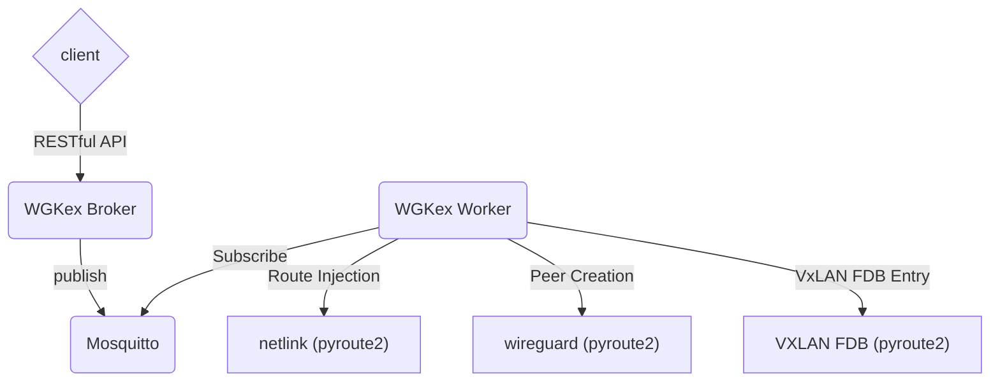

# WGKex

[](https://coveralls.io/github/freifunkMUC/wgkex?branch=main)
[](https://github.com/freifunkMUC/wgkex/actions/workflows/pylint.yml)
[](https://github.com/freifunkMUC/wgkex/actions/workflows/black.yml)
[](https://github.com/freifunkMUC/wgkex/actions/workflows/bazel.yml)

- [WGKex](#wgkex)
  - [Overview](#overview)
    - [Frontend broker](#frontend-broker)
    - [Backend worker](#backend-worker)
  - [Installation](#installation)
  - [Configuration](#configuration)
  - [Development](#development)
    - [Build using Bazel](#build-using-bazel)
    - [Updating PIP dependencies for Bazel](#updating-pip-dependencies-for-bazel)
    - [Unit tests](#unit-tests)
    - [Run Worker \& Broker using Bazel](#run-worker--broker-using-bazel)
    - [Run Worker \& Broker using Python](#run-worker--broker-using-python)
    - [Client](#client)
    - [MQTT topics](#mqtt-topics)
  - [Contact](#contact)

wgkex was started as a WireGuard key exchange tool, but has evolved beyond to the main node management tool of FFMUC.

## Overview

WireGuard Key Exchange is a tool consisting of two parts: a frontend (broker) and a backend (worker). These components
communicate to each other via MQTT - a messaging bus.



### Frontend broker

The frontend broker is where the client can push (register) its key before connecting. These keys are then pushed into
an MQTT bus for all workers to consume.

The frontend broker exposes the following API endpoints for use:

```
/api/v1/locations
/api/v1/wg/key/exchange
/api/v2/wg/key/exchange
```

The listen address and port for the Flask server can be configured in `wgkex.yaml` under the `broker_listen` key:

```yaml
broker_listen:
  # host defaults to 127.0.0.1 if unspecified
  host: 0.0.0.0
  # port defaults to 5000 if unspecified
  port: 5000
```

#### GET /api/v1/locations

Returns a list of available location identifiers configured for the gateways.
This endpoint can be used by clients to discover which location preferences are supported.

Example response:

```json
{
  "locations": ["MUC", "Vienna"]
}
```

#### POST /api/v1/wg/key/exchange

JSON POST'd to this endpoint should be in this format:

```json
{
  "domain": "CONFIGURED_DOMAIN",
  "public_key": "PUBLIC_KEY"
}
```

The broker will validate the domain and public key, and if valid, will push the key onto the MQTT bus.


#### POST /api/v2/wg/key/exchange

JSON POST'd to this endpoint should be in this format:

```json
{
  "domain": "CONFIGURED_DOMAIN",
  "public_key": "PUBLIC_KEY",
  "location": "PREFERRED_LOCATION"
}
```

The `location` field is optional. If specified, the broker will prefer selecting a gateway in the requested location,
while still maintaining load balancing within that location. If the requested location has no available gateways
or is unknown, the broker will fall back to selecting from all available gateways.

The broker will validate the domain and public key, and if valid, will push the key onto the MQTT bus.
Additionally it chooses a worker (aka gateway, endpoint) that the client should connect to.
The response is JSON data containing the connection details for the chosen gateway:

```json
{
  "Endpoint": {
    "Address": "GATEWAY_ADDRESS",
    "Port": "GATEWAY_WIREGUARD_PORT",
    "AllowedIPs": [
      "GATEWAY_WIREGUARD_INTERFACE_ADDRESS"
    ],
    "PublicKey": "GATEWAY_PUBLIC_KEY"
  }
}
```

### Backend worker

The backend (worker) waits for new keys to appear on the MQTT message bus. Once a new key appears, the worker performs
validation task on the key, then injects those keys into a WireGuard instance(While also updating the VxLAN FDB).
It reports metrics like number of connected peers and instance data like local address, WG listening port and
external domain name (configured in config.yml) back to the broker.
Each worker must run on a machine with a unique hostname, as it is used for separation of metrics.

This tool is intended to facilitate running BATMAN over VXLAN over WireGuard as a means to create encrypted
high-performance mesh links.

For further information, please see this [presentation on the architecture](https://www.slideshare.net/AnnikaWickert/ffmuc-goes-wild-infrastructure-recap-2020-rc3)

## Installation

- TBA

## Configuration

- Configuration file

The `wgkex` configuration file defaults to `/etc/wgkex.yaml` ([Sample configuration file](wgkex.yaml.example)), however
can also be overwritten by setting the environment variable `WGKEX_CONFIG_FILE`.

## Development

### Build using [Bazel](https://bazel.build)

```sh
# modify .bazelversion if you want to test another version of Bazel (using Bazelisk)
bazel build //wgkex/broker:app
bazel build //wgkex/worker:app
# artifacts will be at ./bazel-bin/wgkex/{broker,worker}/app respectively
```

### Updating PIP dependencies for Bazel

This package is using Bazel's `compile_pip_requirements` to get a requirements_lock.txt file.
In order to update the respective depencencies after modifying the requirements.txt, run:

```sh
bazel run //:requirements.update
```

### Unit tests

The test can be run using

```sh
bazel test ... --test_output=all
```

or

```sh
python3 -m unittest discover -p '*_test.py'
```

### Run Worker & Broker using Bazel

1. After having built the broker and worker (see above),
   set up dummy interfaces for the worker using this script:

   ```sh
   interface_linklocal() {
     # We generate a predictable v6 address
     local macaddr="$(echo $1 | wg pubkey |md5sum|sed 's/^\(..\)\(..\)\(..\)\(..\)\(..\).*$/02:\1:\2:\3:\4:\5/')"
     local oldIFS="$IFS"; IFS=':'; set -- $macaddr; IFS="$oldIFS"
     echo "fe80::$1$2:$3ff:fe$4:$5$6"
   }

   sudo ip link add wg-welt type wireguard
   wg genkey | sudo wg set wg-welt private-key /dev/stdin
   sudo wg set wg-welt listen-port 51820
   addr=$(interface_linklocal $(sudo wg show wg-welt private-key))
   sudo ip addr add $addr dev wg-welt
   sudo ip link add vx-welt type vxlan id 99 dstport 0 local $addr dev wg-welt
   sudo ip addr add fe80::1/64 dev vx-welt
   sudo ip link set wg-welt up
   sudo ip link set vx-welt up
   ```

2. Generate a development configuration:

   ```sh
   sed -E '/(ffmuc_muc|ffwert|ffdon)/d' wgkex.yaml.example > wgkex.yaml
   ```

3. Run the broker in a terminal:

   ```sh
   # defaults to /etc/wgkex.yaml if not set
   export WGKEX_CONFIG_FILE=$PWD/wgkex.yaml
   ./bazel-bin/wgkex/broker/app
   ```

4. And run the worker in a second terminal:

   ```sh
   export WGKEX_CONFIG_FILE=$PWD/wgkex.yaml
   # the worker requires admin permissions to read interfaces
   sudo -E ./bazel-bin/wgkex/worker/app
   ```

### Run Worker & Broker using Python

Follow steps above to set generate the new config and export the `WGKEX_CONFIG_FILE`
then start the broker and worker like the following:

- Broker (Using Flask development server)

  ```sh
  FLASK_ENV=development FLASK_DEBUG=1 FLASK_APP=wgkex/broker/app.py python3 -m flask run
  ```

- Worker

  ```sh
  python3 -c 'from wgkex.worker.app import main; main()'
  ```

### Client

The client can be used via CLI:

```sh
wget -q -O- --post-data='{"domain": "ffmuc_welt","public_key": "o52Ge+Rpj4CUSitVag9mS7pSXUesNM0ESnvj/wwehkg="}' 'http://127.0.0.1:5000/api/v2/wg/key/exchange'
```

and it should output something similar to:

```json
{
  "Endpoint": {
    "Address": "gw04.ext.ffmuc.net",
    "AllowedIPs": [
      "fe80::27c:16ff:fec0:6c74"
    ],
    "Port": "40011",
    "PublicKey": "TszFS3oFRdhsJP3K0VOlklGMGYZy+oFCtlaghXJqW2g="
  }
}
```

Or use Python instead of wget:

```python
import requests
key_data = {"domain": "ffmuc_welt","public_key": "o52Ge+Rpj4CUSitVag9mS7pSXUesNM0ESnvj/wwehkg="}
broker_url = "http://127.0.0.1:5000"
push_key = requests.get(f'{broker_url}/api/v2/wg/key/exchange', json=key_data)
print(f'Key push was: {push_key.json().get("Message")}')
```

### MQTT topics

- Publishing keys broker->worker: `wireguard/{domain}/{worker}`
- Publishing metrics worker->broker: `wireguard-metrics/{domain}/{worker}/connected_peers`
- Publishing worker status: `wireguard-worker/{worker}/status`
- Publishing worker data: `wireguard-worker/{worker}/{domain}/data`

## Contact

[Freifunk Munich Mattermost](https://chat.ffmuc.net)
